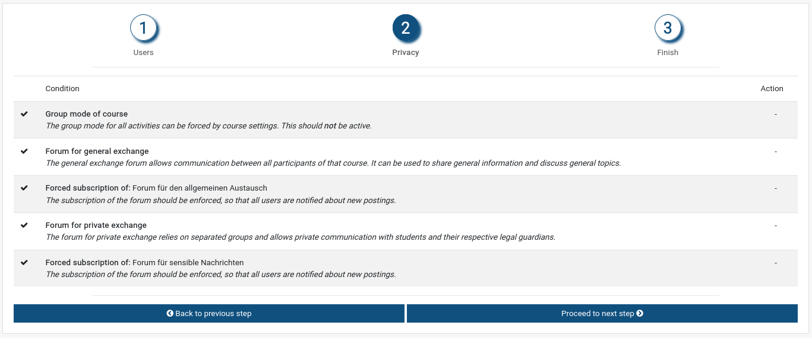
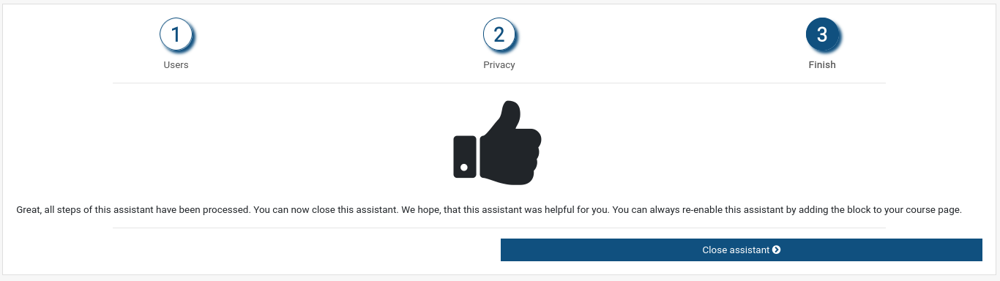

# moodle-block_edureportbook

This plugin is an assistant to prepare an existing course as a notebook for communication between parents and teachers.

The functionality of this plugin is independent from the "[Parent role](https://docs.moodle.org/311/en/Parent_role)" as described in the Moodle docs, which makes a relation between user accounts. In contrast to this Parent role, this plugin works on the course level.

Using this plugin allows teachers to automatically create one group per student and assign their parents as group members in a very user friendly way. In the first step (user enrolment), a temporary accesscode can directly be obtained by the use of the plugin block_enrolcode. Therefore, this plugin is marked as dependency upon installation. Such a code can be used as an invitation link to the course with a customized expiration date. Please refer to the plugins description in the [Moodle plugins database](https://moodle.org/plugins/block_enrolcode/).

Further, it helps teachers to create two forums that allow fluent communication - one forum without groups for general communication, and one forum with separated groups for private communication.

For installation and configuration please refer to the
[installation-reference](doc/installation.md).
