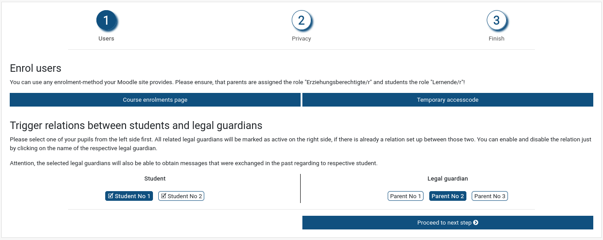

# moodle-block_edureportbook
This plugin is an assistant to prepare an existing course
as a notebook for communication between parents and teachers.

Using this plugin allows teachers to automatically create
groups inside a course based on the names of the students,
and assigning their parents as group members accordingly.

That way a moodle forum using separated groups can be used
for a private communication between parents and teachers.

Optionally students can too be member of the group.

For installation and configuration please refer to our [installation-reference](doc/installation.md).
