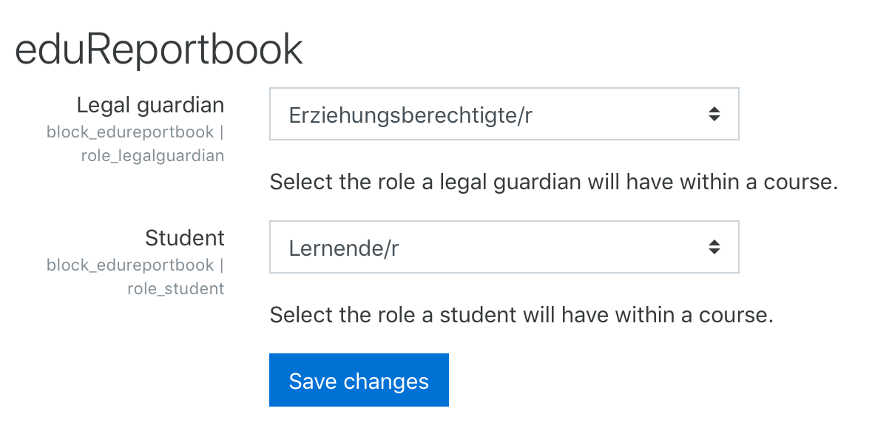

# moodle-block_edureportbook
## Installation
Best way to install this plugin is the [Moodle plugins-database](https://moodle.org/plugins/block_edureportbook).

You can too install directly from this GIT repository using the master-branch.

## Configuration
If you intend to use this plugin in your Moodle you have to create a dedicated role for legal guardians. For doing so please follow the guide at the [Moodle documentation](https://docs.moodle.org/36/en/Creating_custom_roles)

When doing so choose the "Student"-Role as role archetype. That way legal guardians can be treated the same way as students in courses.

In the site administration of eduReportbook you have to configure the roles for students and legal guardians.

https://your.moodle.domain/admin/settings.php?section=blocksettingedureportbook

